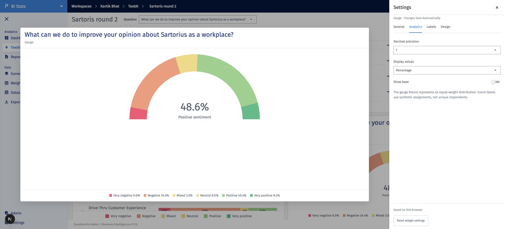

# Text AI widget settings — prototype implementation

28 September 2026. [Approved requirement](text-ai-widget-settings-requirement.md). Preview: http://127.0.0.1:3000/text-ai/1

## Delivered

All nine production widget types have **⋮ → Settings**, a BI-style right drawer, enlarged live preview, relevant General/Analytics/Labels/Columns/Design tabs, automatic browser-local saves, reset, validation and save-error feedback. Settings are isolated by dashboard and widget; newly added cards and their settings survive reload. Dashboard design is inherited unless overridden. Sentiment colors retain their category identities.

- Gauge: precision, values, base and legend.
- Theme/Sub-theme bars: orientation, display selection, ordering, hierarchy and expansion.
- Trend: interval, average-sentiment formatting, axes, labels and tooltips.
- Comparative/Sub-theme comparative: values, precision, selection, slicers, Overall, hierarchy, grouping and existing stat-testing behavior.
- Text Viewer: required Responses column, optional columns/order, date order, page size, wrapping, highlighting and response filters.
- Bubble: theme/sub-theme level, selection, minimum mentions, names/values and legend.
- Summary: saved existing summary mode, section visibility and compact presentation; caveats remain visible.

Existing prototype-only KPI by Theme and Sub-theme trend controls are preserved.

## Validation

33 targeted tests pass (settings, dashboard design, segment filters and staged tags). Targeted ESLint and the final repository-wide TypeScript check pass. Browser checks cover all nine drawers, relevant controls/reset, per-widget isolation, reload, added-card persistence/removal, empty results, column sorting/reordering/search, and dashboard/widget/None filter behavior. The Text Viewer table inputs are memoized after a console check exposed a pagination update loop; sorting, column changes and search were rechecked without a new error.

## Prototype boundaries

- The existing widgets use disconnected synthetic fixtures. Text Viewer applies text/date response filters. The eight aggregate widgets show an explicit unavailable-results state while a response filter is active; choosing None restores their baseline. Raw response aggregation remains an integration requirement.
- Gauge count/base values are explicitly synthetic assignments, not unique respondents. Trend uses illustrative daily average-sentiment observations and weighted period grouping to demonstrate the approved metric; it is not a validated production calculation.
- Comparative percentages retain their existing source base; overlapping categories are never summed into unique respondents. No new statistics engine is introduced.
- Persistence is local to the browser. Existing export/share/backend placeholders are not implemented by this feature; production export/shared-view parity requires integration.
- Source selection remains in the existing add flow. Existing theme/sub-theme toolbar selector behavior is unchanged.

